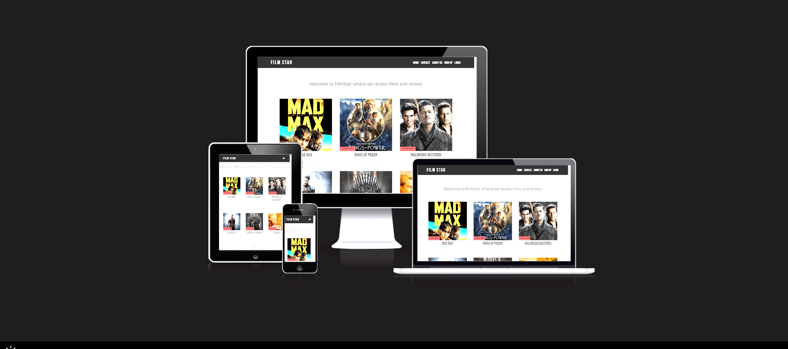

# Film Star

[View the published site on Heroku](https://filmstar22.herokuapp.com/).

Image is from [Am I Responsive](http://ami.responsivedesign.is/).

## Project Overview

Film Star is a website that means to provide the user with a set of reviews of both movies and TV-shows, so that the user can make a decision whether or not they wish to watch them. The user can like and comment on posts, as well as contact the admin with any questions or thoughts, by signing up for an account and log in. 

## User Experience (UX) 

## Strategy 

### Project Goals

The main purspose of Film Star is to provide the user with a set of reviews of films and TV-shows. The user can create an account to interact with posts and the admin, through liking and commenting, or by filling out the contact form.

The target audience for this website is anyone that is interested in cinema. This is a broad audience, which can become even broader with a wider set of genres reviewed in the future. 

### User Stories

* __Site User Goals:__

  * As a User I can like or unlike a post so that share my opinion on the post
  * As a User I can comment on a post so that share my thoughts
  * As a User I can create an account so that take part of the posts
  * As a User/Admin I can view comments so that I will know what people have to say about my post
  * As a User/Admin I can view likes so that I can see how people think about my post
  * As a User/Admin I can view comments so that I will know what people have to say about my post
  * As a User I can open a post so that take part of the information posted
  * As a User I can go the contact page so that I can contact the site's admin for any questions I have
  * As a User I can click on social media links so that I can follow the admin on other social media platforms
  * As a User I can go to the home and about pages so that I can use the app and understand its purpose
  * As a a User I can use navigation tabs so that I can easily navigate through the app
  * As a User I can view a paginated list of posts so that easily find what I wish to take part of

  * __Site Owner Goals:__

  * As a site admin I can create, read, update or delete posts so that easily manage my blog

  ## Scope

To achieve the strategy goals laid out, I have taken the following steps:

* A navigation bar at the top of the screen, which was custom-made, to allow the user to navigate through the website with ease.
* A Home page, that allowed the user to view which reviews are available.
* An About us page, which gives the user information regarding the website's purpose.
* A Contact page, which allows the user to contact the admin.
* A Login page, which gives the user access to their account.
* A Sign Up page, which allows the user to create an account.
* A Log Out page, so that the user can log out of their accont when they're done using it.
* A Post Detail page, to post detailed information regarding the reviews.
* A Footer at the bottom of the screen, with social media links and copyright text.
* A responsive website, which works on all screen sizes, without sacrificing user experience.
* A CRUD functional admin page, to allow the admin to create, read, update and delete posts.

## Design 

### Colors 

For the main body I chose to use #FAFAFA as a standard background color. It was specifically chosen as #FFF is too bright. #1C1B1B was used for the background color of the header and footer, as #000 is too strong. By using these contrasting colors, the user can clearly distinguish between the body and the header/footer, for easier usage. 

### Typography 

The fonts were sourced from [Google Fonts](https://fonts.google.com/).

For the logo, navigation links and the headers I chose to use Bebas Neue.

For the main body text I used Noto Sans.

I chose to not use extravagent fonts, as it wouldn't suit the purpose of the website. 

## Skeleton

### Database

During the production of this website SQLite/Postgres was used as a main database. When the website was deployed, Heroku Postgres was used instead. 

The database contains four models, of which one is a custom model

* __Post__: This model contains information regarding the posts created by the admin.
* __Comment__: This model contains information regarding the comments written by the site user
* __User__: This model contains information regarding the user. It is a built-in model of Django.
* __Contact__: Contains information regarding the contact form submitted by the user. 