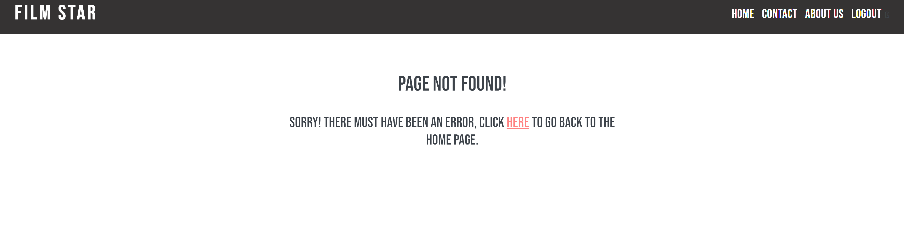
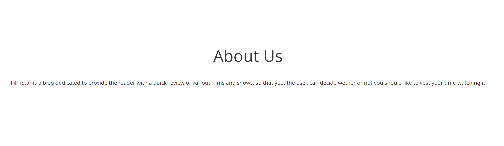

# Film Star

[View the published site on Heroku](https://filmstar22.herokuapp.com/).

Image is from [Am I Responsive](http://ami.responsivedesign.is/).

## Project Overview

Film Star is a website that means to provide the user with a set of reviews of both movies and TV-shows, so that the user can make a decision whether or not they wish to watch them. The user can like and comment on posts, as well as contact the admin with any questions or thoughts, by signing up for an account and log in. 

## Table of Contents

1. [User Experience (UX)](#ux)
    * [Strategy](#strategy)
        * [Project Goals](#strategy)
        * [User Stories](#user-stories)
    * [Scope](#scope)
    * [Design](#design)
        * [Colors](#colors)
        * [Typography](#typography)
    * [Skeleton](#skeleton)
        * [Database](#database)
2. [Features](#features)
    * [Current Features](#current-features)
    * [Future Features](#future-features)
3. [Technologies Used](#tech-used)
4. [Testing](#testing)
    * [User Stories Testing](#user-stories-testing)
    * [Validation Testing](#val-testing)
    * [Automated Testing](#auto-testing)
    * [Known Issues and Fixes](#bugs-and-fixes)
5. [Deployment](#deployment)
6. [Credits](#credits)
    * [Content](#content)
    * [Media](#media)
    * [Code](#code)

## User Experience (UX) 

## Strategy 

### Project Goals 

The main purspose of Film Star is to provide the user with a set of reviews of films and TV-shows. The user can create an account to interact with posts and the admin, through liking and commenting, or by filling out the contact form.

The target audience for this website is anyone that is interested in cinema. This is a broad audience, which can become even broader with a wider set of genres reviewed in the future. 

### User Stories 

* __Site User Goals:__

  * As a User I can like or unlike a post so that share my opinion on the post
  * As a User I can comment on a post so that share my thoughts
  * As a User I can create an account so that take part of the posts
  * As a User/Admin I can view comments so that I will know what people have to say about my post
  * As a User/Admin I can view likes so that I can see how people think about my post
  * As a User/Admin I can view comments so that I will know what people have to say about my post
  * As a User I can open a post so that take part of the information posted
  * As a User I can go the contact page so that I can contact the site's admin for any questions I have
  * As a User I can click on social media links so that I can follow the admin on other social media platforms
  * As a User I can go to the home and about pages so that I can use the app and understand its purpose
  * As a a User I can use navigation tabs so that I can easily navigate through the app
  * As a User I can view a paginated list of posts so that easily find what I wish to take part of

  * __Site Owner Goals:__

  * As a site admin I can create, read, update or delete posts so that easily manage my blog

  #### User Story Progress

  **Start**

**Step 2**

**Step 3**

**Step 4**

**Step 5**

**Step 6**

## Scope 

To achieve the strategy goals laid out, I have taken the following steps:

* A navigation bar at the top of the screen, which was custom-made, to allow the user to navigate through the website with ease.
* A Home page, that allowed the user to view which reviews are available.
* An About us page, which gives the user information regarding the website's purpose.
* A Contact page, which allows the user to contact the admin.
* A Login page, which gives the user access to their account.
* A Sign Up page, which allows the user to create an account.
* A Log Out page, so that the user can log out of their accont when they're done using it.
* A Post Detail page, to post detailed information regarding the reviews.
* A Footer at the bottom of the screen, with social media links and copyright text.
* A responsive website, which works on all screen sizes, without sacrificing user experience.
* A CRUD functional admin page, to allow the admin to create, read, update and delete posts.

## Design 

### Colors 

For the main body I chose to use #FAFAFA as a standard background color. It was specifically chosen as #FFF is too bright. #1C1B1B was used for the background color of the header and footer, as #000 is too strong. By using these contrasting colors, the user can clearly distinguish between the body and the header/footer, for easier usage. 

### Typography 

The fonts were sourced from [Google Fonts](https://fonts.google.com/).

For the logo, navigation links and the headers I chose to use Bebas Neue.

For the main body text I used Noto Sans.

I chose to not use extravagent fonts, as it wouldn't suit the purpose of the website. 

## Skeleton 

### Database 

During the production of this website SQLite/Postgres was used as a main database. When the website was deployed, Heroku Postgres was used instead. 

The database contains four models, of which one is a custom model

* __Post__: This model contains information regarding the posts created by the admin.
* __Comment__: This model contains information regarding the comments written by the site user
* __User__: This model contains information regarding the user. It is a built-in model of Django.
* __Contact__: Contains information regarding the contact form submitted by the user. 

## Features 

### Current Features 

For this project I chose to create a website with different pages, accessed by the navigation links in the header. Thisis fully responsive for desktops, tablets and phones. When reaching a phone screen, the navigation links turn into a hamburger menu, which is accessed on the right side of the screen, as I considered it to be more user friendly than the left side. 

The website also has a few different interactive features for the user, such as liking, commenting, contacting the admin, signing up, signing in and signin out. 

__Navigation__:

* The navigation feature is present on all pages of this website, and is fixed to the top of the screen. 
* The logo is on the left-hand side, whilst the links are on the right. All links and the logo have a hover effect, whereby a line expands below the links, indicating where the mouse is hovered. This gives the website a much better aesthetic.
* If the user enters an invalid url, they are shown an error 404 page not found, as seen below:

__Footer__:

* The footer is present on all pages of this website, and is fixed to the bottom. It has the same background color as the header, and  contains the social media links and copyright information.
* The social media links have a hover effect, whereby they turn red, indicating where the mouse is hovered. 

__Contact__:

* The contact page is accessed through the navigation menu. 
* The user can send in any message they wish. A field requiring their email is present, so that the admin can respond to the user's message.

__Features Exclusive to the Admin__:

* The Admin is the only one capable of approving and deleting comments sumbitted by users.
* The Admin is the only one capable of creating, updating and deleting posts.

### Future Features 

Due to time constraints a few features where not able to be created for this website, and can be implemented in the future.

* A feature that allows the user to create their own review posts, much like on Rotten Tomatoes or Imdb.

* A feature that allows the user to edit and/or delete their own posted comments on the posts. 

* A search bar in the header, so that the user can easily look up any post they wish to view.

## Technologies Used 

* [Django](https://docs.djangoproject.com/en/3.1/): 
    * Django the main framework used in the making of this project.
* [Bootstrap](https://getbootstrap.com/): 
    * Bootstrap was used for the responsiveness of the website, with exception of the header. 
* [HTML5](https://developer.mozilla.org/en-US/docs/Web/HTML):
    * HTML was used as the basic structure for building this project, mainly through a base file, which was then extended to all other html files. 
* [CSS3](https://developer.mozilla.org/en-US/docs/Learn/Getting_started_with_the_web/CSS_basics):
    * CSS was used to give this project styles and a way to give the visitor a good user experience.
* [Javascript](https://developer.mozilla.org/en-US/docs/Web/JavaScript/Guide):
    * Javascript was used to write interactive functions for this website, such as the navigation menu on smaller screens.
* [Python](https://www.python.org/): 
    * Different python modules were used to build this website.
* [Gitpod](https://www.gitpod.io/): 
    * Gitpod was used to write the code and style the project.
* [Github](https://github.com/): 
    * Github was used to store the project after it had been pushed.
* [Git](https://git-scm.com/):
    * Git was used for version control by commiting to Git and pushing to Github.
* [Heroku](https://herokuapp.com/):
    * Heroku was used to deploy this project.
* [Google](https://www.google.se/):
    * Google was used to download and display images on the posts.
* [Google Fonts](https://getbootstrap.com/): 
    * Google fonts was used to source the fonts of this project.
* [Font Awesome](https://fontawesome.com/): 
    * Font Awesome was used to apply icons in this project.
* [Chrome Dev Tools](https://developers.google.com/web/tools/chrome-devtools): 
    * Google Developer Tools was used to identify bugs, and to test performance of the website.
* [W3C Markup Validation Service](https://validator.w3.org/): 
    * W3C was used to validate all the HTML code written in this project.
* [W3C CSS Validation Service](https://jigsaw.w3.org/css-validator/): 
    * W3C CSS validation was used to validate the CSS written in this project.
* [Beautifytools](https://beautifytools.com/javascript-validator.php): 
    * Beautifytools was used to validate the JavaScript code used on this project.
* [Favicon.io](https://favicon.io/)
    * Favicon.io was used to obtain the favicon.
* [Cloudinary](https://cloudinary.com/): 
    * Cloudinary was used to store the media and static files of this project.
* [Am I Responsive](http://ami.responsivedesign.is/):
    * Am I Responsive was used for showcasing the website at the top of this readme document.

## Testing 

The testing documentation for this project can be found [here](https://github.com/Hemenhk/locations-api/blob/main/TESTING.md)

### User Stories Testing 

From the home page, the user is presented with various different navigation links. These are the Logo, Home button, Contact button, About Us button, Login button, Sign up button and Logout button. Each of these links has the following effect once clicked: 

* Logo --> will take the user to the home page.
* Home --> will take the user to the home page.
* Conact  --> will take the user to the contact page.
* About Us --> will take the user to the about us page.
* Logout --> will take the user to the log out page.
* Login --> will take the user to the log in page.
* Sign Up --> will take the user to the sign up page.

The navigation links can be easily accessed at the top of the page. When on smaller screens, they can be accessed by clicking on the hamburger menu, whereby a side menu will appear will all navigation links present on the right-hand side. 

The main section of the home page displays the posted reviews, paginated by a number of six on each page, as seen above. The user can navigate the reviews by clicking on the "next/previous" button, as seen below. Each post has an image, the author's name and the date of its post. 

At the bottom of all pages is the footer. Here are the links to different social media urls. Each is functional and has a hover effect, that turns the links red. There is also copyright information present here as well.

The user stories achieved on the home page are:

* As a a user I can use navigation tabs so that I can easily navigate through the app
* As a user I can click on social media links so that I can follow the admin on other social media platforms
* As a user I can go to the home and about pages so that I can use the app and understand its purpose
* As a user I can view a paginated list of posts so that easily find what I wish to take part of
* As a user I can open a post so that take part of the information posted

The contact page offers the user a way to contact the admin by filling out a form, as seen below. Due to the sharp brightness when taking the screenshot, the fields are not fully visible in the images.

Once the form is completed the user will be redirected to another page, where a message appears, stating that the message has been successfully sent to the admin.

The user stories achieved on the home page is:

* As a user I can go the contact page so that I can contact the site's admin for any questions I have

The about page displays the purpose of this website to the user.

The user stories achieved on the home page is:

* As a user I can go to the home and about pages so that I can use the app and understand its purpose.

When clicking the sign up button, the user is taken to a page where they can register an account, of which they can interact with the posts. 

The user stories achieved on the home page is:

* As a user I can create an account so that I can take part of the posts

If the user already has an account they can log in using the login link in the header. When logged in, an alert message appears informing the user that they have successfully logged in. When logged in the sign up link disappears. 

If the user already has an account they can log out using the logoyt link in the header. When logged out, an alert message appears informing the user that they have successfully logged out of their account. When logged out the sign up and login links appear. 

Users with an account have the ability to like/unlike and comment on posts.

The post detail will be the same for user with accounts as for users without. The only difference being the ability to comment and like on the posts. 

The user stories achieved on the post detail page are:

* As a user I can view comments so that I will know what people have to say about my post.
* As a user I can view likes so that I can see how people think about my post
* As a user I can like or unlike a post so that share my opinion on the post
* As a user I can comment on a post so that share my thoughts

__User Stories Exclusive To Admin - Testing__

The admin section is accessed by typing "/admin" at the end of home url for the website.

The admin site has various functionalities such as:

* Managing posts
* Managing comments
* Deleting users

(Due to the screenshot, the image is much brighter than in reality.)

The admin has the option of creating, updating and deleting posts. Each post has a title, slug, main body of text and an image. The admin can choose whether to publish the post or to keep it as a draft for further embellishments.

The user stories achieved on the admin panel is:

* As a site admin I can create, read, update or delete posts so that easily manage my blog

### Validation Testing 

To test the HTML code used, W3C Markup Validation Service was used.

* Home, Post Detail and Base files: 

* Contact Page 

* Contact Page 

* About Page 

* Logout Page 

* Signup Page 

* Login Page 

A common error found was a trailing space behind a "hr" tag. However, this issue was persistent even after resolved. Other than that, no concerning issues were found. 

To test the CSS code used, W3C CSS Validation Service was used.

No errors were found in the CSS file, as seen below.

To test the JavaScript code, Beautifytools was used.

No errors were found when testing the javascript code.

Testing the python code had to be manually done in the console of gitpod, as PEP8 Validator was not available during the project. The only persistent errors found are in the settings.py file and are too long lines. However, these lines are generated by Django automatically and have been left as they are. 

I also used Chrome Developer Tools to test the website on both desktop and mobile. 

The lowest score is on the home page, which is due to the images posted on there. They have lowered the performance down to the 40s. 

Home Page:

* [Desktop](static/media/home%20page%20testing%20-%20desktop.png)
* [Mobile](static/media/home%20page%20testing%20-%20mobile.png

Contact Page:

* [Desktop](static/media/contact%20page%20testing%20-%20desktop.png)
* [Mobile](static/media/contact%20page%20testing%20-%20mobile.png)

About Us Page:

* [Desktop](static/media/about%20us%20testing%20-%20desktop.png)
* [Mobile](static/media/about%20us%20testing%20-%20mobile.png)

Sign Up Page:

* [Desktop](static/media/signup%20testing%20-%20desktop.png)
* [Mobile](static/media/signup%20testing%20-%20mobile.png)

Login Page:

* [Desktop](static/media/login%20testing%20-%20desktop.png)
* [Mobile](static/media/login%20testing%20-%20mobile.png)

Logout Page:

* [Desktop](static/media/logout%20testing%20-%20desktop.png)
* [Mobile](static/media/logout%20testing%20-%20mobile.png)

Furthermore, the webiste was tested on the following browsers:

* Google Chrome
* Mozilla Firefox
* Safari

The website was also tested on the following devices:

* PC
* iPhone 12 and Pro
* iPad Air
* MacBook Pro

### Automated Testing 

Testing was also completed by using Django TestCase. Test files can be found in blog > tests folder. The files tested are:

* test_forms.py
* test_models.py
* test_urls.py
* test_views.py

During testing SQLite was used as a database. In the settings.py file the following code was written to toggle between SQLite and Heroku Postgres, when developing and deploying the website:

* DEVELOPMENT = False

if DEVELOPMENT:
    DATABASES = {
        'default': {
            'ENGINE': 'django.db.backends.sqlite3',
            'NAME': os.path.join(BASE_DIR, 'db.sqlite3'),
        }
    }
else:
    DATABASES = {
        'default': dj_database_url.parse(os.environ.get('DATABASE_URL'))
    }

[Coverage](https://pypi.org/project/coverage/) was used during the testing phase to see how many functions of python code had been tested. In total 63% of code have been tested.

### Known Issues and Fixes 

* Initially the home and about pages had background images, instead of a white background. This was changed due to the images not displaying after the project had been deployed to Heroku. There were no syntax errors that caused the error to happen. To solve this, I had to remove the images and replace the background with #FAFAFA instead. 

* When testing the website, the Javascript code did not load properly, causing the navigation menu to not work on smaller screens. This was solved by loading the scripts at the very end of the body. 

* During the build of this project my custom CSS would not load properly after each change. This caused unneccessary time delays, as it took a while to figure out the issue behind it. The solution was to clear cached images and files in Google Chrome. 
 
## Deployment 

The project was developed using GitPod and deployed via GitHub repository to Herokuapp by following these steps:

1. On the Heroku dashboard, click "New" in the top right-hand corner.
2. Select "Create new app".
3. Type in the app name and select the region (in my case it is Europe). 
4. Click "Create app".
5. Select "Settings" and then click on "BuildPacks". 
6. Add "Python" and save changes.
7. Go to "Config Vars" and add "KEY" and "Value" for DATABASE_URL, SECRET_KEY and CLOUDINARY_URL 
8. Click on "Deploy" section at the top.
9. Select Github as deployment method.
10. Click on "Connect to GitHub" and then locate the repository name.
11. In the "Resources" tab add "Heroku Postgres"
13. Select the "Hobby Dev-Free".
14. Select "Enable Automatic Deploys" and then select "Deploy Branch to deploy the project.
15. When the project has successfully deployed, a "view" option will become available to see the finished website. 

## Credits 

### Content 

All reviews were obtained from [IMDB](https://www.imdb.com/?ref_=nv_home), and are real reviews posted by different users. 

* Mad Max review was found on [IMDB](https://www.imdb.com/title/tt1392190/reviews?ref_=tt_urv)

* Lord of the Rings review was found on [IMDB](https://www.imdb.com/title/tt0120737/reviews?ref_=tt_urv)

* Rings of Power review was found on [IMDB](https://www.imdb.com/title/tt7631058/reviews?ref_=tt_urv)

* Inglorious Basterds review was found on [IMDB](https://www.imdb.com/title/tt0361748/reviews?ref_=tt_urv)

* Game of Thrones review was found on [IMDB](https://www.imdb.com/title/tt0944947/reviews?ref_=tt_urv)

* Django Unchained review was found on [IMDB](https://www.imdb.com/title/tt1853728/reviews?ref_=tt_urv)

* Gladiator review was found on [IMDB](https://www.imdb.com/title/tt0172495/reviews?ref_=tt_urv)

* Peaky Blinders review was found on [IMDB](https://www.imdb.com/title/tt2442560/reviews?ref_=tt_urv)

### Media 

Images used on this project were obtained from the following sources:

Post detail images:

* All images were gotten from [Google](https://www.google.se/imghp?hl=sv&authuser=0&ogbl)

Favicon:

* [Favicon.io](https://favicon.io/)

### Code 

* A large part of the code used on this project was used and inspired from Code Institute's "I think Therefore I Blog" tutorial, to build the skeleton base. Some of the borrowed code has been customised by me to fit this project. 

* To build the contact form and pages, code was borrowed from [twilio](https://www.twilio.com/blog/build-contact-form-python-django-twilio-sendgrid) to assist in the project. 

* [Bootstrap](https://getbootstrap.com/) was used to help build the overall responsiveness of this project. 

* To assist with the testing phase of this project, [The-Dumbfounds](https://www.youtube.com/watch?v=qwypH3YvMKc&list=PLbpAWbHbi5rMF2j5n6imm0enrSD9eQUaM&index=2) and Code Institute's "Hello Django" tutorials were utilised. 